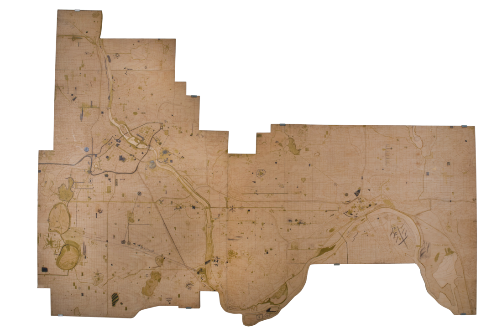

# The Mapping of Joy and Pain

## [Try it out!](borchert.github.io/joy-pain)

## Technical background
The basemap was created using [MapBox Studio](https://www.mapbox.com/mapbox-studio-classic/), combining a hand drawn aesthetic with a woodgrain texture to evoke the original map. The mapping utilizes Esri products. The ArcGIS JavaScript API handles map movement and interaction, while ArcGIS Online services are used for data storage. The dialog boxes are made with [Vex](http://github.hubspot.com/vex/docs/welcome/).

## The Original Map

